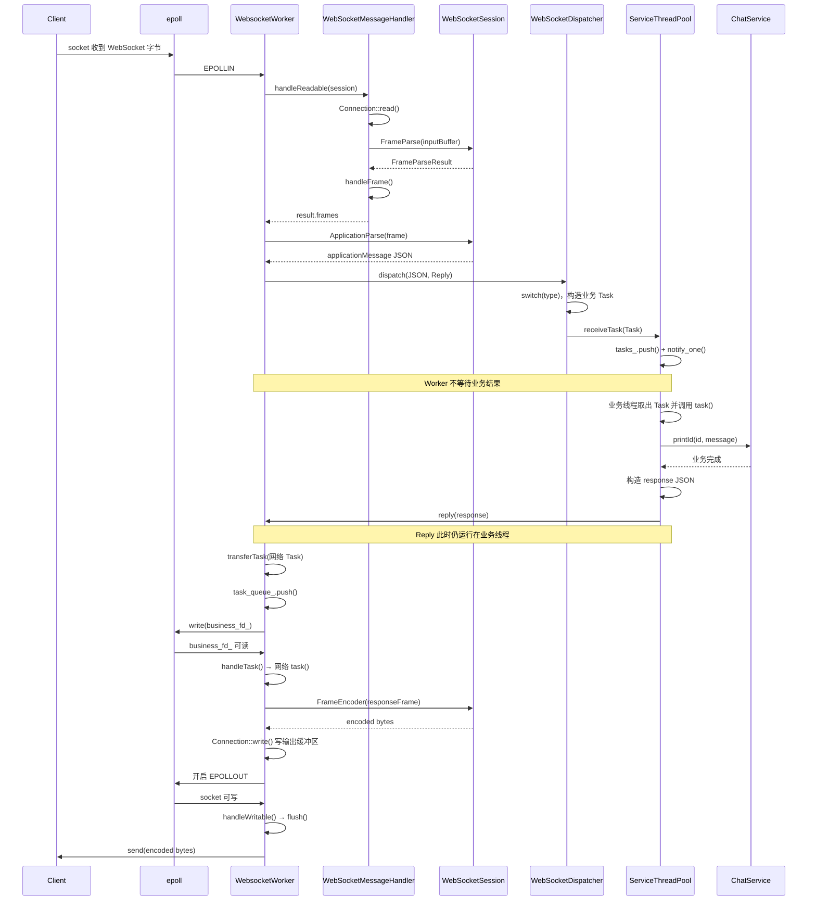

# WebSocketWorker 从接收消息到发送响应的完整流程

本文解释当前项目中，一条 WebSocket 业务消息从 socket 可读开始，经过帧解析、应用层解析、业务线程池，再返回 WebSocket Worker 并发送给客户端的全过程。

阅读本文不要求提前理解 `epoll`、`eventfd`、lambda 或线程池。文中会说明每一次函数调用发生在哪个线程、数据被放进哪个队列，以及代码什么时候只是“保存一个任务”、什么时候才真正执行任务。

## 1. 参与流程的组件

| 组件 | 主要职责 |
| --- | --- |
| `WebsocketWorker` | 管理一组 WebSocket 连接，等待 epoll 事件，执行网络读写任务 |
| `WebSocketSession` | 保存一个连接及其会话状态，解析和编码 WebSocket Frame |
| `WebSocketMessageHandler` | 从连接读取字节，检查 Frame，并处理 Ping、Pong、Close |
| `WebSocketDispatcher` | 根据应用消息中的 `type` 选择业务处理逻辑 |
| `ServiceThreadPool` | 保存并执行可能访问数据库的业务 Task |
| `ChatService` | 执行实际聊天业务 |
| `Connection` | 保存输入、输出缓冲区，并执行底层 `recv()` 和 `send()` |

其中最重要的线程边界是：

```text
WebSocket Worker 线程
        ↓ 投递业务 Task
ServiceThreadPool 业务线程
        ↓ Reply 投递网络 Task
原 WebSocket Worker 线程
```

业务线程不能直接操作 `websocket_sessions_map`、`Connection` 或 `epoll_fd_`。这些网络状态只在拥有该连接的 Worker 线程中操作。

## 2. 两个 Task 和两个队列

当前代码使用同一种 Task 外形：

```cpp
using Task = std::function<void()>;
```

但是流程中存在两个用途不同的 Task：

| Task | 保存在哪个队列 | 由哪个线程执行 | 内容 |
| --- | --- | --- | --- |
| 业务 Task | `ServiceThreadPool::tasks_` | 业务线程 | 调用 `ChatService` 并构造业务结果 |
| 网络 Task | `WebsocketWorker::task_queue_` | WebSocket Worker | 编码响应 Frame 并写入连接 |

两者都是 `void()`，但它们不是同一个任务，也不会在同一个线程中执行。

两个关键入队语句分别是：

```cpp
// ServiceThreadPool::receiveTask()
tasks_.push(std::move(task));
```

```cpp
// WebsocketWorker::transferTask()
task_queue_.push(std::move(task));
```

## 3. 总体调用链

一条普通 Text 业务消息的调用链如下：

```text
WebsocketWorker::worker()
  └─ epoll_wait() 返回 EPOLLIN
      └─ WebsocketWorker::handleReadable(fd)
          └─ WebSocketMessageHandler::handleReadable(session)
              ├─ Connection::read()
              ├─ WebSocketSession::FrameParse()
              └─ WebSocketMessageHandler::handleFrame()
          └─ WebSocketSession::ApplicationParse(frame)
          └─ WebSocketDispatcher::dispatch(json, reply)
              ├─ parseType(type)
              ├─ 构造业务 Task
              └─ ServiceThreadPool::receiveTask(task)
                  ├─ tasks_.push(task)
                  └─ cv_.notify_one()

ServiceThreadPool 业务线程
  └─ 从 tasks_ 取出业务 Task
      └─ task()
          ├─ ChatService::printId()
          ├─ 构造 response JSON
          └─ reply(response)
              └─ WebsocketWorker::transferTask(网络 Task)
                  ├─ task_queue_.push(网络 Task)
                  └─ taskWakeup()
                      └─ write(business_fd_)

WebSocket Worker 线程
  └─ epoll_wait() 发现 business_fd_ 可读
      └─ WebsocketWorker::handleTask()
          └─ 执行网络 Task
              ├─ 查找并校验 Session
              ├─ response.dump()
              ├─ WebSocketSession::FrameEncoder()
              ├─ Connection::write()
              └─ setWriteInterest(fd, true)
  └─ epoll_wait() 返回 EPOLLOUT
      └─ WebsocketWorker::handleWritable(fd)
          └─ Connection::flush()
              └─ send()
```

## 4. 第一步：epoll 通知 Worker 连接可读

每个 `WebsocketWorker` 都运行自己的 `worker()` 循环：

```cpp
const int eventCount = ::epoll_wait(
    epoll_fd_,
    events.data(),
    static_cast<int>(events.size()),
    -1
);
```

`epoll_wait()` 大部分时间处于睡眠状态。客户端发送数据后，Linux 将对应 socket 标记为可读，`epoll_wait()` 返回一个带有 `EPOLLIN` 的事件。

Worker 判断事件类型：

```cpp
if ((flags & EPOLLIN) != 0) {
    handleReadable(fd);
}
```

此时仍在 WebSocket Worker 线程中。

同一个 epoll 中还注册了三个特殊 fd：

| fd | 作用 |
| --- | --- |
| `event_fd_` | HTTP 线程向 Worker 移交新连接时唤醒 Worker |
| `business_fd_` | 业务线程向 Worker 投递网络 Task 时唤醒 Worker |
| `timer_fd_` | 定时唤醒 Worker，执行心跳检查 |

本次客户端消息来自普通 WebSocket socket，所以进入 `handleReadable(fd)`。

## 5. 第二步：找到 fd 对应的 Session

`handleReadable()` 先从 Worker 的 Session 表中查找连接：

```cpp
auto iterator = websocket_sessions_map.find(fd);
if (iterator == websocket_sessions_map.end()) {
    return;
}

WebSocketSession& session = *iterator->second;
```

`websocket_sessions_map` 的 key 是 socket fd，value 是 `WebSocketSession`。

Session 保存：

- `Connection`；
- 会话 ID；
- 上次活动时间；
- Ping/Pong 状态；
- Frame 解析和编码功能。

如果找不到 fd，说明连接已经关闭或被移除，本次事件不再处理。

## 6. 第三步：Handler 从 socket 读取字节

Worker 调用：

```cpp
WebSocketHandleResult result =
    message_handler_.handleReadable(session);
```

进入 `WebSocketMessageHandler::handleReadable()` 后，首先取得 Session 中的 Connection：

```cpp
Connection& connection = session.connection();
```

然后读取 socket：

```cpp
const ssize_t bytesRead = connection.read();
```

`Connection::read()` 内部调用 `recv()`，并把收到的字节追加到 `input_buffer_`。

这里必须使用输入缓冲区，因为 TCP 是字节流：

- 一次 `recv()` 可能只收到半个 WebSocket Frame；
- 一次 `recv()` 也可能同时收到多个 Frame；
- TCP 不保留发送端调用 `send()` 时的消息边界。

因此，读取成功不代表已经得到一条完整消息。

## 7. 第四步：FrameParse 从输入缓冲区解析 Frame

读取到字节后调用：

```cpp
FrameParseResult parsed =
    session.FrameParse(connection.inputBuffer());
```

`FrameParse()` 检查并解析：

- FIN 位；
- Opcode；
- MASK 位；
- payload 长度；
- masking key；
- payload；
- 控制帧限制；
- 最大 payload 大小。

解析结果包括：

```cpp
struct FrameParseResult {
    FrameParseStatus status;
    std::size_t consumed;
    std::vector<Frame> frames;
};
```

`consumed` 表示已经成功解析了多少字节。Handler 随后调用：

```cpp
connection.consumeInput(parsed.consumed);
```

只删除已经消费的字节。尚未组成完整 Frame 的尾部字节继续留在输入缓冲区，等待下一次 `EPOLLIN`。

三种解析状态的含义：

| 状态 | 含义 |
| --- | --- |
| `Success` | 得到了一个或多个完整 Frame |
| `NeedMoreData` | 当前缓冲区还不能组成完整 Frame |
| `Error` | Frame 违反 WebSocket 协议 |

## 8. 第五步：handleFrame 区分业务帧和控制帧

每个解析完成的 Frame 都会进入：

```cpp
handleFrame(session, std::move(frame), result)
```

### 8.1 Text 和 Binary

当前简单版本要求业务帧必须满足 `fin == true`：

```cpp
case Opcode::Text:
case Opcode::Binary:
    if (!frame.fin) {
        result.status = WebSocketHandleStatus::ProtocolError;
        return false;
    }

    result.frames.push_back(std::move(frame));
    return true;
```

通过检查的业务 Frame 被放入 `result.frames`，之后返回 Worker。

当前版本还没有实现分片消息重组，因此 `Continuation` 或 `fin == false` 会被当作协议错误。

### 8.2 Ping

收到 Ping 后，Handler 立即构造 Pong，并把 Ping 的 payload 原样放入 Pong：

```text
Ping → FrameEncoder(Pong) → Connection::write()
```

随后设置：

```cpp
result.output_queued = true;
```

Worker 看见这个标记后会开启 `EPOLLOUT`。

### 8.3 Pong

收到 Pong 后调用：

```cpp
session.handlePong();
```

它会取消 `waiting_for_pong_` 并更新活动时间。Pong 不进入 Dispatcher。

### 8.4 Close

收到 Close 后，Handler 构造 Close Reply，写入输出缓冲区，并把状态设置为 `PeerClosed`。Worker 等 Close Reply 发送完毕后删除 Session。

## 9. 第六步：ApplicationParse 将 Frame 变成应用 JSON

Handler 返回后，Worker 遍历通过检查的业务 Frame：

```cpp
for (Frame& frame : result.frames) {
    nlohmann::json applicationMessage =
        session.ApplicationParse(frame);
}
```

`ApplicationParse()` 将 WebSocket 协议信息和 payload 整理成统一 JSON。

例如客户端 Text Frame 的 payload 是：

```json
{
  "type": "chat.newTextMessage",
  "id": "message-1001",
  "message": "hello"
}
```

解析后大致得到：

```json
{
  "header": {
    "fin": true,
    "opcode": 1,
    "opcode_name": "text",
    "payload_length": 81
  },
  "payload_format": "json",
  "payload": {
    "type": "chat.newTextMessage",
    "id": "message-1001",
    "message": "hello"
  }
}
```

如果 Text payload 不是合法 JSON，`payload_format` 为 `text`；Binary payload 使用 `bytes`。

## 10. 第七步：Worker 创建 Reply 并调用 Dispatcher

Worker 调用：

```cpp
dispatcher_.dispatch(
    std::move(applicationMessage),
    [this, fd, sessionId](nlohmann::json response) mutable {
        // Reply 函数体
    }
);
```

这里传入两个参数：

1. 解析完成的应用 JSON；
2. 一个 `Reply` 回调。

Reply 的类型是：

```cpp
using Reply = std::function<void(nlohmann::json)>;
```

此时 Reply 只是一个保存起来的函数对象，还没有执行。它捕获了：

- `this`：当前 Worker；
- `fd`：原连接的文件描述符；
- `sessionId`：原连接的会话 ID。

同时保存 fd 和 sessionId 是为了防止旧 fd 关闭后被操作系统分配给新连接。

## 11. 第八步：Dispatcher 选择业务并构造业务 Task

`WebSocketDispatcher::dispatch()` 读取：

```cpp
std::string type = payload["type"];
```

随后：

```cpp
switch (parseType(type)) {
    case WebsocketRouter::NewTextMessage:
        // 构造对应业务 Task
}
```

匹配 `chat.newTextMessage` 后构造业务 Task：

```cpp
Task task = [
    this,
    payload = std::move(payload),
    header = std::move(header),
    reply = std::move(reply)
]() mutable {
    // 业务 Task 函数体
};
```

执行到这里时，Task 的函数体还没有运行。lambda 只是生成了一个可调用对象，其中保存了代码以及捕获的 `payload`、`header` 和 `reply`。

## 12. 第九步：业务 Task 进入 ServiceThreadPool

Dispatcher 调用：

```cpp
threadPool_.receiveTask(std::move(task));
```

`ServiceThreadPool::receiveTask()` 加锁并入队：

```cpp
{
    std::lock_guard<std::mutex> lock(mutex_);
    tasks_.push(std::move(task));
}

cv_.notify_one();
```

其中：

- `tasks_.push()` 才是真正把业务 Task 放进业务线程池队列；
- `cv_.notify_one()` 唤醒一个等待任务的业务线程。

Dispatcher 随后返回，WebSocket Worker 不会等待业务执行结果，可以继续处理其他 socket 事件。

## 13. 第十步：业务线程取出并执行 Task

业务线程平时等待：

```cpp
cv_.wait(lock, [this] {
    return stop_ || !tasks_.empty();
});
```

被唤醒后取出队首 Task：

```cpp
task = std::move(tasks_.front());
tasks_.pop();
```

离开互斥锁作用域以后才执行：

```cpp
task();
```

必须先释放锁再执行 Task，否则一个耗时数据库操作会长期占用队列锁，阻止其他线程提交或取得任务。

这次 `task()` 执行的是 Dispatcher 中定义的业务 lambda：

```cpp
const std::string id = payload["id"];
const std::string message = payload["message"];

threadPool_.chatService.printId(id, message);
```

此时代码运行在 ServiceThreadPool 的业务线程，而不是 WebSocket Worker 线程。

## 14. 第十一步：业务 Task 构造 response 并调用 Reply

业务完成后构造响应：

```cpp
nlohmann::json response{
    {"type", "newTextMessage.result"},
    {"success", true},
    {"id", id}
};
```

然后调用：

```cpp
reply(std::move(response));
```

这里没有一个单独的“结果收集器”。业务结果是 Task 内部的局部变量，完成后直接作为参数传给 Reply。

`reply()` 也不是普通的函数返回值。它会执行 Worker 在 `handleReadable()` 中传入的那个 lambda。

调用关系可以展开为：

```text
reply(response)
  等价于
执行 Worker 定义的 Reply lambda(response)
```

Reply 此时运行在业务线程中，因此仍然不能直接访问 Worker 的 Session 表或 Connection。

## 15. 第十二步：Reply 构造网络 Task

Reply 的函数体调用：

```cpp
transferTask(
    [this,
     fd,
     sessionId,
     response = std::move(response)]() mutable {
        // 网络 Task 函数体
    }
);
```

内层 lambda 没有参数也没有返回值，因此可以转换为：

```cpp
std::function<void()>
```

这个网络 Task 保存了：

- 要执行的代码；
- Worker 指针；
- fd；
- sessionId；
- response JSON。

调用 `transferTask()` 时，网络 Task 的函数体仍然没有执行。

## 16. 第十三步：网络 Task 进入 Worker 队列

`WebsocketWorker::transferTask()` 执行：

```cpp
{
    std::lock_guard<std::mutex> lock(mutex_);
    task_queue_.push(std::move(task));
}

taskWakeup();
```

真正把网络 Task 放进 Worker 队列的是：

```cpp
task_queue_.push(std::move(task));
```

随后 `taskWakeup()` 向 `business_fd_` 写入一个 `uint64_t`：

```cpp
::write(business_fd_, &value, sizeof(value));
```

这次 `write()` 不是向客户端发送消息。它只是让 `business_fd_` 变为可读，从而唤醒阻塞在 `epoll_wait()` 中的 Worker。

## 17. 第十四步：Worker 被 business_fd_ 唤醒

Worker 的 epoll 循环发现：

```cpp
if (fd == business_fd_) {
    handleTask();
    continue;
}
```

`handleTask()` 首先读取 `business_fd_`，清除它的可读状态，然后把共享队列中的 Task 快速交换到局部队列：

```cpp
std::queue<Task> localTasks;

{
    std::lock_guard<std::mutex> lock(mutex_);
    localTasks.swap(task_queue_);
}
```

这样可以缩短持锁时间。其他业务线程可以继续向 `task_queue_` 投递新任务。

随后 Worker 逐个执行：

```cpp
Task task = std::move(localTasks.front());
localTasks.pop();
task();
```

这里的 `task()` 才真正进入 Reply 创建的网络 lambda。

## 18. 第十五步：网络 Task 校验 Session

网络 Task 首先使用 fd 查找 Session：

```cpp
const auto sessionIterator =
    websocket_sessions_map.find(fd);
```

如果连接已经关闭，则放弃响应：

```cpp
if (sessionIterator == websocket_sessions_map.end()) {
    return;
}
```

随后验证 Session ID：

```cpp
if (targetSession.id() != sessionId) {
    return;
}
```

为什么不能只检查 fd？因为 Linux 可能复用已经关闭的 fd。假设旧连接的 fd 是 12，关闭以后新连接也可能获得 fd 12。`sessionId` 可以防止旧业务结果误发给新连接。

## 19. 第十六步：把 response 编码成 WebSocket Frame

先将 JSON 转为字符串：

```cpp
const std::string responseText = response.dump();
```

然后构造 Text Frame：

```cpp
Frame responseFrame;
responseFrame.fin = true;
responseFrame.opcode = Opcode::Text;
responseFrame.payload.assign(
    responseText.begin(),
    responseText.end()
);
```

调用编码器：

```cpp
const std::vector<std::uint8_t> encoded =
    targetSession.FrameEncoder(responseFrame);
```

`FrameEncoder()` 添加 WebSocket 帧头和 payload 长度。服务器发给客户端的 Frame 不进行 masking。

## 20. 第十七步：写入 Connection 输出缓冲区

网络 Task 调用：

```cpp
targetSession.connection().write(...);
```

当前 `Connection::write()` 只做一件事：

```cpp
output_buffer_.append(data.data(), data.size());
```

它没有立刻调用 `send()`。这样可以正确处理非阻塞 socket 暂时无法发送全部数据的情况。

随后调用：

```cpp
setWriteInterest(fd, true);
```

它通过 `epoll_ctl(EPOLL_CTL_MOD)` 给这个 socket 增加 `EPOLLOUT` 监听。

## 21. 第十八步：EPOLLOUT 触发真正发送

当内核判断 socket 可以继续写时，epoll 返回 `EPOLLOUT`：

```cpp
if ((flags & EPOLLOUT) != 0) {
    handleWritable(fd);
}
```

`handleWritable()` 调用：

```cpp
const ssize_t bytesWritten = connection.flush();
```

`Connection::flush()` 才真正调用底层 `send()`。

如果全部数据已经发送：

```cpp
setWriteInterest(fd, false);
```

Worker 取消 `EPOLLOUT` 监听。必须取消，否则只要 socket 可写，epoll 就可能持续通知 Worker，造成无意义的 CPU 循环。

如果只发送了一部分，未发送数据仍保留在输出缓冲区，Worker 继续等待下一次 `EPOLLOUT`。

## 22. 时序图



## 23. 一条消息的数据形态变化

```text
TCP 字节流
    ↓ Connection::read()
input_buffer_
    ↓ FrameParse()
Frame { fin, opcode, payload bytes }
    ↓ ApplicationParse()
applicationMessage JSON
    ↓ Dispatcher
业务 Task 捕获的 payload JSON
    ↓ ChatService
response JSON
    ↓ Reply
网络 Task 捕获的 response JSON
    ↓ response.dump()
JSON 字符串
    ↓ FrameEncoder()
WebSocket 字节流
    ↓ Connection::write() + flush()
客户端
```

## 24. 为什么不能让业务线程直接发送

如果业务线程直接访问 Session 和 socket，将带来以下问题：

1. Worker 和业务线程可能同时修改同一个 `Connection` 输出缓冲区；
2. Worker 可能正在删除 Session，而业务线程仍持有它的引用；
3. 多个线程可能同时调用 `epoll_ctl()`；
4. 需要给 Session、Connection 和 epoll 状态增加大量锁；
5. 很难保证同一连接上的消息发送顺序。

现在的设计让业务线程只计算结果，再把网络操作投递回原 Worker，因此网络状态仍然由单一线程管理。

## 25. `std::move` 在流程中的作用

消息和 Task 在多个队列之间传递时经常使用 `std::move`：

```cpp
threadPool_.receiveTask(std::move(task));
reply(std::move(response));
task_queue_.push(std::move(task));
```

这里不是立即执行对象，而是把对象内部资源的所有权移交给下一层：

- Dispatcher 将业务 Task 移交给 ServiceThreadPool；
- 业务 Task 将 response 移交给 Reply；
- Reply 将网络 Task 移交给 Worker 队列。

移动以后，不应继续依赖被移动对象原来的内容。

## 26. 最容易混淆的三个地方

### 26.1 定义 lambda 不等于执行 lambda

```cpp
Task task = [...] {
    // 这里暂时不会执行
};
```

只有以后调用：

```cpp
task();
```

函数体才会运行。

### 26.2 Reply 不是 Worker 的任务队列

Reply 是：

```cpp
std::function<void(nlohmann::json)>
```

它接收业务结果，并在函数体中调用 `transferTask()`。真正进入 Worker 队列的是 Reply 构造的内层网络 Task。

### 26.3 `Connection::write()` 不代表已经发送

```text
Connection::write()
    只追加到 output_buffer_

Connection::flush()
    才调用 send()
```

因此写入缓冲区后还必须开启 `EPOLLOUT`。

## 27. 最关键的五行代码

理解整个流程时，可以先记住下面五行：

```cpp
// 1. Worker 把应用消息交给 Dispatcher
dispatcher_.dispatch(applicationMessage, reply);

// 2. Dispatcher 把业务 Task 放进业务池
threadPool_.receiveTask(std::move(task));

// 3. 业务线程真正执行业务 Task
task();

// 4. 业务 Task 把 response 交给 Reply
reply(std::move(response));

// 5. Reply 把网络 Task 放回 Worker
transferTask(networkTask);
```

这五步构成了当前 WebSocket 异步业务处理模型的主干。

